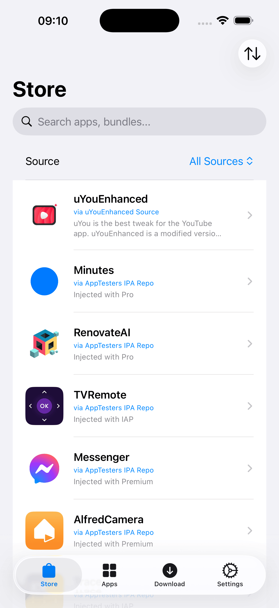
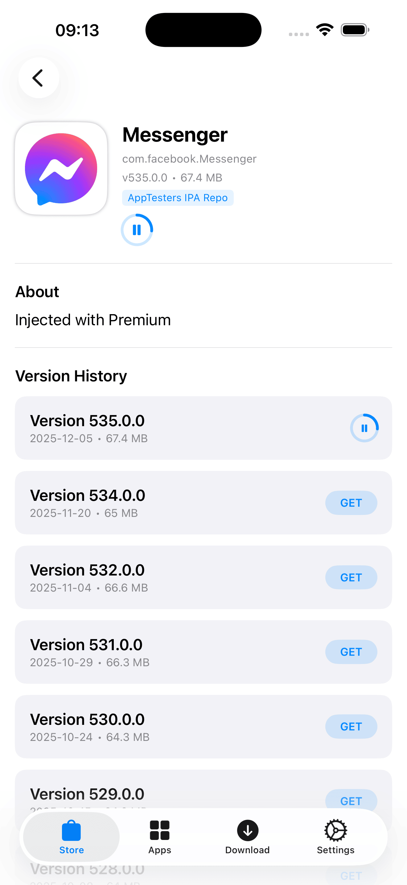
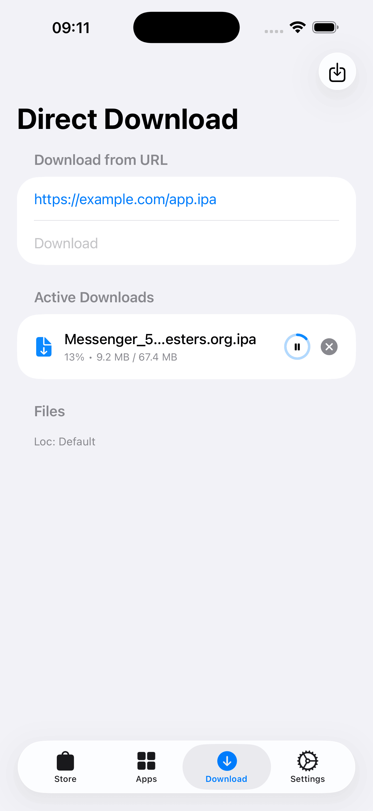
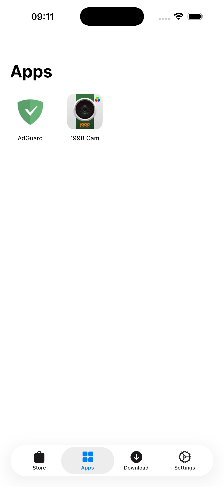

<div align="center">
   
</div>

<div align="center">
  <h1><b>LBox</b></h1>
  <p><i>A native iOS repository manager and downloader offering seamless integration with LiveContainer. Browse public sources, download IPAs, and install/launch apps directly on your device.</i></p>
</div>

---

> **⚡ Quick Start**: To enable automatic app installation to LiveContainer, select its directory ("On My iPhone" > "LiveContainer") on your device (see **[Fix File Picker](#fix-file-picker)** if unable). Then, enable **"Auto .ipa to .app"** in LBox Settings.

## 📥 Download

**[Download Latest IPA](https://github.com/Lolendor/LBox/releases/download/build-1/LBox.ipa)**

## 🚀 Overview

**LBox** bridges the gap between finding apps and running them on iOS. Instead of manually searching for IPA files and moving them around the file system, LBox allows you to add repositories (similar to AltStore or ESign), download apps in the background, and automatically extract them into your LiveContainer storage.

## 📱 Screenshots

| Store View | App Details | Downloads | Installed Apps |
|:---:|:---:|:---:|:---:|
|  |  |  |  |

## ✨ Key Features

*   **Repository Management**:
    *   Add and manage unlimited public repositories (JSON format).
    *   Organize sources into folders.
    *   Import/Export repository lists via JSON or Clipboard.
*   **LiveContainer Integration**:
    *   Auto-detects apps installed within the LiveContainer folder.
    *   **One-tap Launch**: Open apps directly from LBox using the `livecontainer://` URL scheme.
    *   **Auto-Install**: Automatically unzips and moves downloaded `.ipa` files to the specific LiveContainer application directory.
*   **Download Manager**:
    *   Robust background downloading with pause/resume support.
    *   Direct download via URL (for IPAs hosted outside user repositories).
    *   Visual progress tracking and local file management.
*   **Version History**:
    *   View and download specific versions of an app (downgrade/upgrade support).
*   **Customization**:
    *   Configure custom storage locations for Downloads and LiveContainer apps (using Security Scoped Bookmarks).
    *   Search, filter, and sort apps by name, date, or size.

## 🛠 How it Works

1.  **Initial Setup**: Upon first launch, LBox will ask for the LiveContainer directory. Select the root folder of your installed LiveContainer app. This step is required for auto-installation and launching apps.
2.  **Add a Source**: Input a URL to a compliant app repository JSON.
3.  **Browse & Download**: Find the app you want and tap "Get". LBox handles the download in the background.
4.  **Install**: LBox detects `.ipa` files. With "Auto .ipa to .app" enabled in Settings, it extracts the payload directly to your LiveContainer/Applications folder.
5.  **Launch**: Navigate to the "Apps" tab and tap the app to run it instantly via LiveContainer.

## ⚙️ Build Instructions

### Prerequisites
*   Mac with Xcode installed.
*   An iOS device (Simulators may not fully support LiveContainer integration).
*   [LiveContainer](https://github.com/khanhduytran0/LiveContainer) installed on the target device.

### Installation
1.  Clone the repository:
    ```bash
    git clone https://github.com/yourusername/LBox.git
    ```
2.  Open LBox.xcodeproj in Xcode.
3.  Select your Development Team in the "Signing & Capabilities" tab.
4.  Build and run on your device.

## ⚠️ Known Issues

*   **"App bundle not found! Unable to read LCAppInfo.plist" Error**:
    You may encounter this error popup immediately after installing an app and trying to launch it for the first time.
    *   **Solution**: Simply dismiss the error and tap the **Run** button again. The app should launch successfully, and this error will not appear on subsequent launches.

*   <a id="fix-file-picker"></a>**Unable to select LiveContainer Directory**:
    If the file picker does not appear or you cannot select a folder during the initial setup:
    *   **Solution**: Open LiveContainer, find **LBox** in the "My Apps" list, press and hold the icon, tap **Settings**, and enable **Fix File Picker**. Then try selecting the directory again.
    

## 📂 File Structure

*   AppData.swift: Handles repository parsing, app models, and data persistence.
*   DownloadManager.swift: Manages URLSession tasks, file system operations, and zip extraction.
*   ContentView.swift: The main navigation and UI entry point.
*   AppDetailView.swift: Displays detailed app information, screenshots, and version history.

## credits

* Developed by Lolendor.
* Designed to work with LiveContainer.

## Support the project

If you find this project useful:

- **TON / USDT (TON)**  `UQAyBchGEKi9NnNQ3AKMQMuO-SGEhMIAKFAbkwwrsiOPj9Gy`

## 📄 License

This project is licensed under the MIT License - see the LICENSE file for details.
